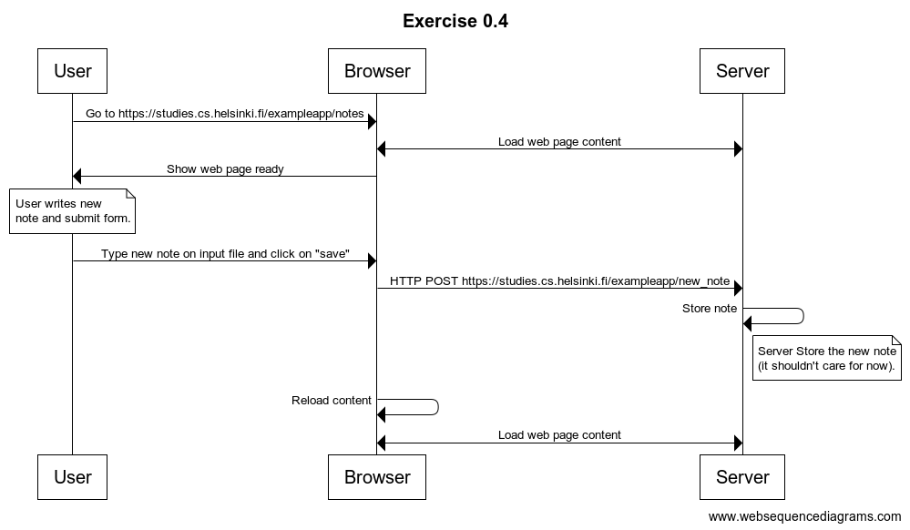
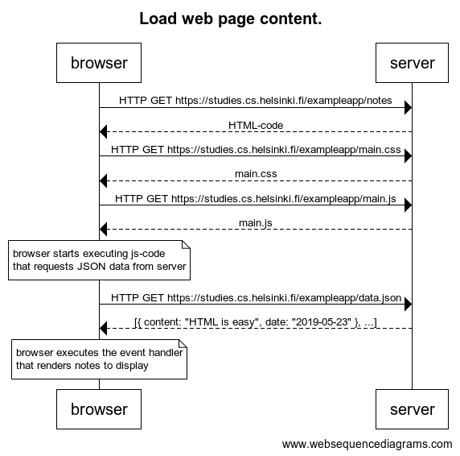

# 📒 **This is PART 0, Exercise 0.4**

---

This is my own response of this exercise using sequence diagram, bout I reuse diagram used by course authors to make shorter answer. So I use messages named `Load  web page content` it represents all steps of [authors' diagram](https://fullstackopen.com/es/part0/fundamentos_de_las_aplicaciones_web#cargando-una-pagina-que-contiene-java-script-revisada){:target="_blank"}, that is, it represents everything that happens when the user enters [notes fullstackopen](https://studies.cs.helsinki.fi/exampleapp/notes){:target="_blank"}. I know this isn't the most fidelity process, but I think is a resume of principal events.

## **Diagram.** 🔽



## **Diagram code.** 🔽

```
title Exercise 0.4: New note diagram

User->Browser: Go to https://studies.cs.helsinki.fi/exampleapp/notes
Server<->Browser: Load web page content
Browser->User: Show web page ready
note over User:
User writes new
note and submit form.
end note
User->Browser: Type new note on input file and click on "save"
Browser->Server: HTTP POST https://studies.cs.helsinki.fi/exampleapp/new_note
Server->Server: Store note
note left of Server:
Server Store the new note
(it shouldn't care for now).
end note
Browser->Browser: Reload content
Server<->Browser: Load web page content
```

## **Load web page content.**

This is all what happens in `Load web page content` message.


