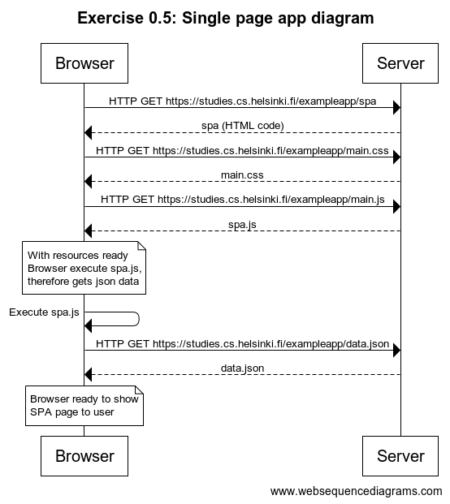

# 📒 **This is PART 0, Exercise 0.5**

---

This is my own response of this exercise.

## **Diagram.** 🔽



## **Diagram code.** 🔽

```
title Exercise 0.5: Single page app diagram

Browser->Server: HTTP GET https://studies.cs.helsinki.fi/exampleapp/spa
Server-->Browser: spa (HTML code)
Browser->Server: HTTP GET https://studies.cs.helsinki.fi/exampleapp/main.css
Server-->Browser: main.css
Browser->Server: HTTP GET https://studies.cs.helsinki.fi/exampleapp/main.js
Server-->Browser: spa.js
note over Browser:
With resources ready
Browser execute spa.js,
therefore gets json data
end note
Browser->Browser: Execute spa.js
Browser->Server: HTTP GET https://studies.cs.helsinki.fi/exampleapp/data.json
Server-->Browser: data.json
note over Browser:
Browser ready to show
SPA page to user
end note
```