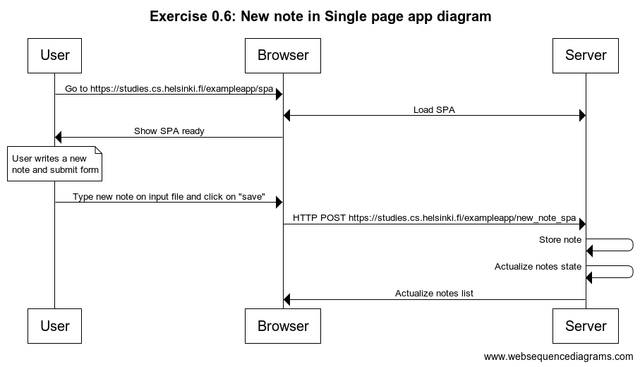

# 📒 **This is PART 0, Exercise 0.6**

---

This is my own response of this exercise. In this case I use `Load SPA` message, it represents everything that happens when the user enters [spa notes fullstackopen](https://studies.cs.helsinki.fi/exampleapp/spa){:target="_blank"} and this message is represents by [Exercise 0.5](./exercise0.5.md)

## **Diagram.** 🔽



## **Diagram code.** 🔽

```
title Exercise 0.6: New note in Single page app diagram

User->Browser: Go to https://studies.cs.helsinki.fi/exampleapp/spa
Browser<->Server: Load SPA
Browser->User: Show SPA ready
note over User:
User writes a new
note and submit form
end note
User->Browser: Type new note on input file and click on "save"
Browser->Server: HTTP POST https://studies.cs.helsinki.fi/exampleapp/new_note_spa
Server->Server: Store note
Server->Server: Actualize notes state
Server->Browser: Actualize notes list
```
