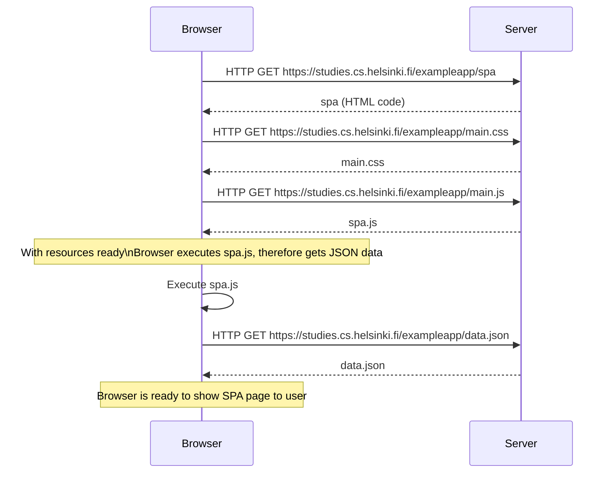

# 📒 **This is PART 0, Exercise 0.5**

---

This is my own response of this exercise.

## **Diagram.** 🔽

```mermaid
sequenceDiagram
    participant Browser
    participant Server

    Browser->>Server: HTTP GET https://studies.cs.helsinki.fi/exampleapp/spa
    Server-->>Browser: spa (HTML code)

    Browser->>Server: HTTP GET https://studies.cs.helsinki.fi/exampleapp/main.css
    Server-->>Browser: main.css

    Browser->>Server: HTTP GET https://studies.cs.helsinki.fi/exampleapp/main.js
    Server-->>Browser: spa.js

    note over Browser: With resources ready\nBrowser executes spa.js, therefore gets JSON data
    Browser->>Browser: Execute spa.js

    Browser->>Server: HTTP GET https://studies.cs.helsinki.fi/exampleapp/data.json
    Server-->>Browser: data.json

    note over Browser: Browser is ready to show SPA page to user
```
