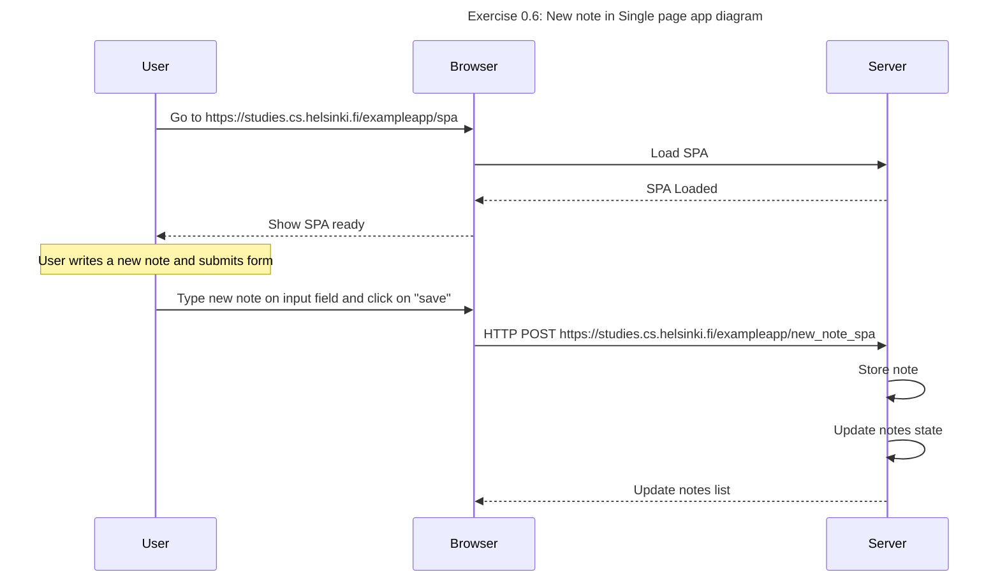

# 📒 **This is PART 0, Exercise 0.6**

---

This is my own response of this exercise. In this case I use `Load SPA` message, it represents everything that happens when the user enters [spa notes fullstackopen](https://studies.cs.helsinki.fi/exampleapp/spa) and this message is represents by [Exercise 0.5](./exercise0.5.md)

## **Diagram.** 🔽



## **Diagram code.** 🔽

```
  sequenceDiagram
    title Exercise 0.6: New note in Single page app diagram

    participant User
    participant Browser
    participant Server

    User->>Browser: Go to https://studies.cs.helsinki.fi/exampleapp/spa
    Browser->>Server: Load SPA
    Server-->>Browser: SPA Loaded
    Browser-->>User: Show SPA ready

    note over User: User writes a new note and submits form
    User->>Browser: Type new note on input field and click on "save"
    Browser->>Server: HTTP POST https://studies.cs.helsinki.fi/exampleapp/new_note_spa
    Server->>Server: Store note
    Server->>Server: Update notes state
    Server-->>Browser: Update notes list
```
