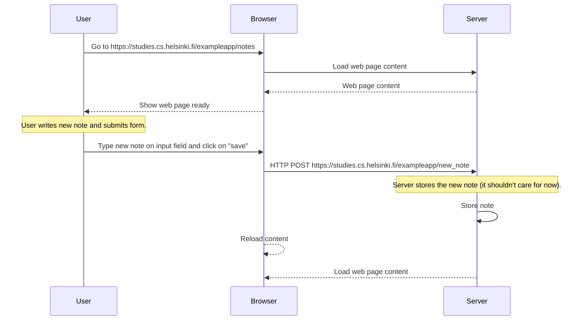

```mermaid
sequenceDiagram
    participant User
    participant Browser
    participant Server

    User->>Browser: Go to https://studies.cs.helsinki.fi/exampleapp/notes
    Browser->>Server: Load web page content
    Server-->>Browser: Web page content
    Browser-->>User: Show web page ready

    note over User: User writes new note and submits form.
    
    User->>Browser: Type new note on input field and click on "save"
    Browser->>Server: HTTP POST https://studies.cs.helsinki.fi/exampleapp/new_note
    note over Server: Server stores the new note (it shouldn't care for now).
    Server->>Server: Store note

    Browser-->>Browser: Reload content
    Server-->>Browser: Load web page content
```
